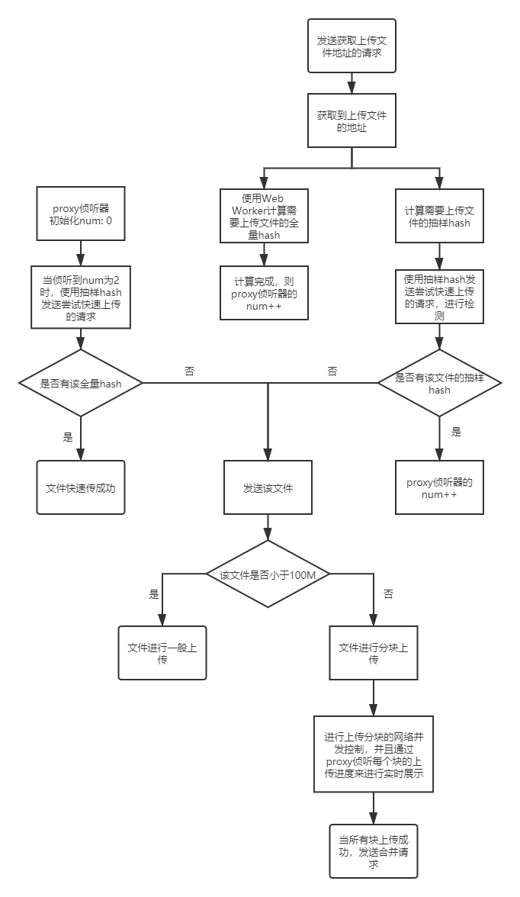

# 项目简介

基于Vue2.x全家桶、Sass预处理器，使用了三端适配、并发控制、大文件分块上传、weinre 真机调试等技术，实现了一个文件共享系统。

## 功能介绍

1. 对于跨域的解决
   - 发送一般请求部分，前端开发时使用webpack devSever 通过before 编写node 代理，上线通过nginx 代理转发。
   - 发送文件上传/下载请求部分，通过跨域资源共享（CORS）解决。并使用JWT，解决认证问题。
4. 对于文件上传
   - 借鉴Vue3.0 的Proxy 侦听的思想，解决Web Worker 和网络请求的并发问题以及分块上传时实时展示总上传进度的问题
   - 使用抽样hash，加快检测出不存在的文件
   - 对于大文件进行分块上传
   - 
4. 使用 localStorage 完成自动登录功能 
5. 通过URL 的query，解决面包屑导航
5. 三端适配

## 待完成功能

- 暂停文件上传/下载
- 报错重传（demo中已经实现）
- 视频音频的在线播放
- ......
# 使用手册

## 整体的使用方法

1. npm run init // 安装依赖（目前只安装前台依赖）
2. npm run dev:front // 运行前台的开发环境
3. npm run dev:admin // 运行后台的开发环境
4. npm run gulp:front // 构建前台的生产环境
5. npm run gulp:admin // 构建后台的生产环境
6. npm run gulp:all // 同时构建前后台的生产环境

## 前台（we-front）和后台（we-file-admin）分别使用方法

## we-file

1. cd ./we-file
2. npm install // 安装前台的依赖
3. npm run serve // 构建前台的开发环境
4. npm run build // 构建前台的生产环境

## we-file-admin（没整理好，未上传）

1. cd ./we-file-admin
2. npm install // 安装后台的依赖
3. npm run serve // 构建后台的开发环境
4. npm run build // 构建后台的生产环境